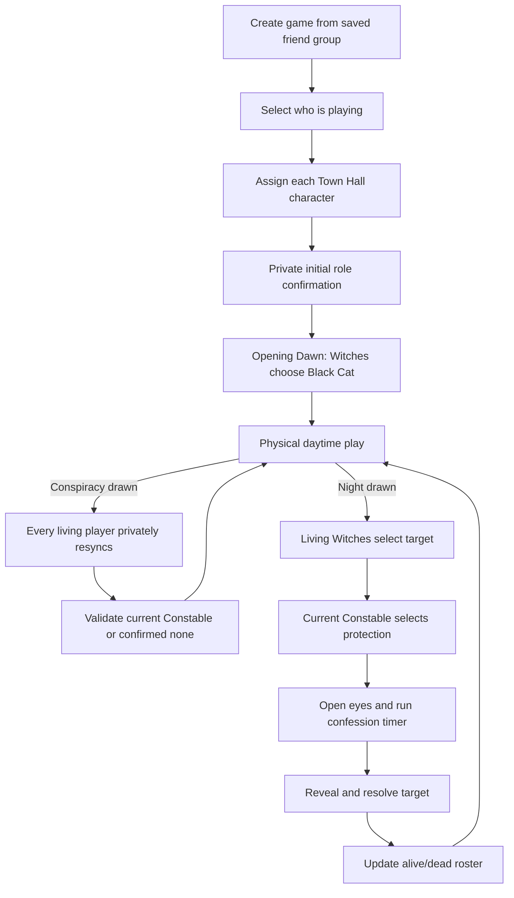

# Salem Night Companion — Product Plan

## 1. Product decision

Build a companion for **Salem 1692** that coordinates setup, hidden role continuity, Opening Dawn, and Night while the physical game remains the source of truth.

Every player joins the room, but only players with a relevant private role receive an action during Dawn or Night. This avoids exposing roles through participation and handles Witch and Constable changes after Conspiracy.

The product must not digitize the entire board game.

## 2. Assumptions

- The group plays the standard 4–12 player Salem 1692 rules.
- Physical Tryal, Town Hall, playing, Black Cat, and Gavel cards remain in use.
- The coordinator may also be a player, so the coordinator must not automatically see hidden roles or private selections.
- Players are sitting together and each can open the web app on a phone.
- Players truthfully report private card changes, just as the physical game already requires.

Rules reference: [Salem 1692 official rulebook](https://cdn.shopify.com/s/files/1/0028/2964/7961/files/Salem_Rulebook_smaller_file_size.pdf?v=1725018865)

## 3. Product boundary

### The app coordinates

- A reusable friend group and tonight's active roster
- Correct Tryal-card setup for the player count
- Player-to-Town-Hall-character mapping
- Private initial role confirmation
- Opening Dawn and Black Cat target selection
- Private role resynchronization after Conspiracy
- Witch target consensus during Night
- Current Constable protection selection
- Public confession timer and outcome resolution
- Alive/dead status and the public game event log
- Reconnection after a refresh or temporary loss of network

### Physical components remain authoritative for

- Exact Tryal cards and their positions
- Accusations and Tryal reveals
- Green, blue, and red playing cards
- Whether Asylum is physically in front of a player
- The truth of every physical Tryal reveal; the app records only the public result

### Explicitly out of scope for the first version

- Full card and deck tracking
- Custom roles and extensive house-rule settings
- Long-term statistics and rankings
- Voice narration and sound effects
- Multiple Salem editions
- Public matchmaking or remote play

## 4. Why every player joins

| Model | Consequence |
| --- | --- |
| Only Witches and Constable join | Joining can reveal the role and newly converted players are awkward to add |
| Coordinator alone | Works only when the coordinator is a non-playing Moderator |
| Everyone joins; only relevant roles act | Preserves secrecy and supports Conspiracy cleanly |
| Digitize every card | Creates more bookkeeping than it removes |

The third model is the agreed default.

## 5. Game flow

Opening Dawn is not Night 1. It happens once at the beginning and assigns the Black Cat. Killing begins when the Night card is reached.

## 6. Setup for variable player counts

The app must calculate the following official setup without requiring the coordinator to consult the rulebook.

| Players | Not a Witch | Witch | Constable | Tryal cards each |
| ---: | ---: | ---: | ---: | ---: |
| 4 | 18 | 1 | 1 | 5 |
| 5 | 23 | 1 | 1 | 5 |
| 6 | 27 | 2 | 1 | 5 |
| 7 | 32 | 2 | 1 | 5 |
| 8 | 29 | 2 | 1 | 4 |
| 9 | 33 | 2 | 1 | 4 |
| 10 | 27 | 2 | 1 | 3 |
| 11 | 30 | 2 | 1 | 3 |
| 12 | 33 | 2 | 1 | 3 |

For seven or fewer players, the setup screen may remind the group of the official option to deal two Town Hall cards to each player and let each keep one. This is guidance only; the app still records one final character per player.

## 7. Core private state

Witch and Constable state must behave differently.

### Witch affiliation

- `everWitch` begins false.
- Receiving a Witch card changes it permanently to true.
- Losing the Witch card later does not change it back.
- `currentWitchCards` records how many unrevealed Witch Tryal cards are currently in front of the player; one player may hold both cards.
- A publicly revealed Witch card reduces that count. Revealing a player's last Witch card eliminates them.
- A living player with `everWitch = true` participates in Witch phases.
- Dead Witches do not participate.

### Constable authority

- Exactly one living player may currently hold the Constable card.
- Receiving the card grants the Night protection action.
- Losing the card removes that action.
- Revealing the Constable card permanently disables the Constable phase.
- A player may be both a Witch and the Constable.
- The Constable cannot protect themselves under the standard 4–12 player rules.

The public coordinator view must never receive these private fields merely because it is rendering the roster.

## 8. Initial role confirmation

After the physical Tryal cards are dealt, every player privately answers:

1. How many Witch cards are currently in front of you?
2. Do you currently have the Constable card?

The app waits for all connected living players. It validates the expected number of unrevealed Witch cards from the setup table and exactly one Constable holder without naming claimants publicly. Counting cards, rather than Witch players, handles the valid case where one player holds both Witch cards. A mismatch produces a neutral request for everyone to recheck.

## 9. Conspiracy role resynchronization

After the physical Conspiracy procedure, every living player receives the same private prompt:

1. How many Witch cards are currently in front of you? Any positive count permanently sets `everWitch`.
2. Do you currently hold the Constable card?

Validation rules:

- Exactly one current Constable claim is expected while the card remains unrevealed.
- The private Witch-card counts must add up to the number of still-unrevealed Witch cards.
- Multiple claims produce a generic conflict and require a recheck.
- Zero claims require the coordinator to confirm that the Constable card was revealed or otherwise resolve the physical discrepancy.
- Former Constables lose their authority immediately.
- A newly converted Witch participates at the next Witch phase.

The app does not track which face-down Tryal slot moved.

## 10. Solving player and character memory

Each active player record contains:

- Display name
- Optional avatar or photo
- Seat number
- Town Hall character name
- Alive/dead status

Every target screen displays the player name prominently, with seat number and Town Hall character as confirmation. Selecting a player replaces searching through physical Kill cards.

The coordinator can record a public Witch-card reveal, record a death, or correct an incorrectly entered character before the first private phase. When a player dies, their tracked Witch cards and Constable card are recorded as publicly revealed.

## 11. Opening Dawn

1. Coordinator starts Opening Dawn.
2. Every device shows the same instruction to close eyes.
3. Living Witches receive the Black Cat target selector.
4. If their submissions agree, the target locks.
5. If they disagree, the Witch screens show only that agreement was not reached and allow resubmission.
6. All screens instruct the Witches to close their eyes.
7. The public screen reveals who receives the Black Cat.
8. The group places the physical Black Cat card and begins daytime play.

Witches may give the Black Cat to one of themselves.

## 12. Night

### Witch phase

- Only living players with `everWitch = true` can submit.
- Each selects a living target from the player roster.
- Witches may target a Witch, including themselves.
- Multiple Witches must reach the same target.
- Individual submissions remain private.
- One living Witch locks their choice immediately.

### Constable phase

- Only the current living Constable receives the selector.
- The Constable cannot choose themselves.
- If the Constable role is unavailable, this phase is skipped without revealing why on private waiting screens.
- A Witch who is also Constable completes the Witch action first and the Constable action second.

### Confession and resolution

1. All screens instruct players to open their eyes.
2. A public hourglass timer begins.
3. Players confess physically by revealing one of their own Tryal cards.
4. The coordinator records any confession that affects the target.
5. The selected target is revealed.
6. The coordinator confirms Gavel, confession, or Asylum protection.
7. The app records survival or death and returns to daytime mode.

The app must not announce a death automatically until the public protection checks are confirmed.

### Public reveals and victory

- Recording a Witch Tryal reveal decrements the public hidden-card total.
- If it is the holder's last Witch card, that player dies; if they still hold another, play continues.
- A death reveals all remaining Tryal cards, so tracked Witch cards are added to the revealed total and a held Constable card disables future Constable phases.
- The Town wins when every Witch Tryal card is recorded as revealed.
- The Witches win when every living player has `everWitch = true`.
- These results are derived only from private confirmations and public events that the group records; the physical cards remain the source of truth.

## 13. Screens

1. **Landing:** Create game, resume game, or join by code.
2. **Friend group:** Save names and optional avatars; select tonight's players.
3. **Setup:** Player count, Tryal composition, character assignment, and invite QR/code.
4. **Private check-in:** Initial role confirmation and readiness.
5. **Coordinator console:** Connections, current phase, Conspiracy, Night, roster corrections, and end game.
6. **Private action:** Witch target, Constable protection, or neutral waiting state.
7. **Public resolution:** Confession timer and Night outcome.
8. **Recap:** Public event history and a new-game action.

## 14. Information visibility

### Public during the game

- Roster, characters, seats, and alive/dead status
- Connection/readiness state
- Current public phase
- Black Cat recipient after Dawn
- Night target after the confession window
- Public protection and outcome
- Public event history

### Private until the game ends

- Whether a player has ever been a Witch
- Current Constable identity
- Individual Witch submissions
- Constable selection before resolution
- Role-sync responses

An optional end-of-game reveal may show the hidden audit history only after the coordinator explicitly ends the game.

## 15. Responses to capture

- Join and readiness confirmations
- Initial private role confirmations
- Conspiracy resynchronization responses
- Witch selections and agreement state
- Constable selection
- Public confessions affecting the target
- Resolution protection reason
- Alive/dead changes
- Phase transitions and public outcomes

Do not capture daytime conversation, suspicions, accusations, or every card played.

## 16. Friend group and game lifetime

- A friend group stores reusable display names and optional avatars only.
- Each new game selects a subset of present players.
- Characters and all role information reset for every new game.
- Joining requires no permanent personal account.
- Each device receives a temporary anonymous identity for reconnection.
- Completed game data should expire automatically after a short retention period, provisionally 24 hours unless the group deliberately keeps a recap.

## 17. MVP acceptance criteria

The first release is successful when:

1. Four to twelve players can join one room from separate phones.
2. The setup composition is correct for every supported player count.
3. Public clients cannot read private roles or unrevealed selections.
4. Opening Dawn produces one agreed Black Cat target.
5. Conspiracy can permanently add a Witch and transfer or remove Constable authority.
6. Night produces one Witch target and, when available, one legal Constable protection target.
7. Refreshing a phone restores the correct player and phase without revealing private state to another player.
8. A protected target survives and an unprotected target can be marked dead.
9. Dead players disappear from future target options.
10. Multiple Witch cards held by one player, Witch-card reveals, Constable removal, and both victory conditions resolve correctly.
11. A new game resets every role while preserving the optional friend-group roster.

## 18. Deferred decisions

- Whether a neutral-Moderator, one-device mode is needed in addition to the default room mode
- Whether to show Salem character artwork or use names and neutral avatars
- Exact room and completed-game retention periods
- Whether hidden actions are revealed in the final recap
- Whether the physical Black Cat and Asylum holders should be tracked between phases
